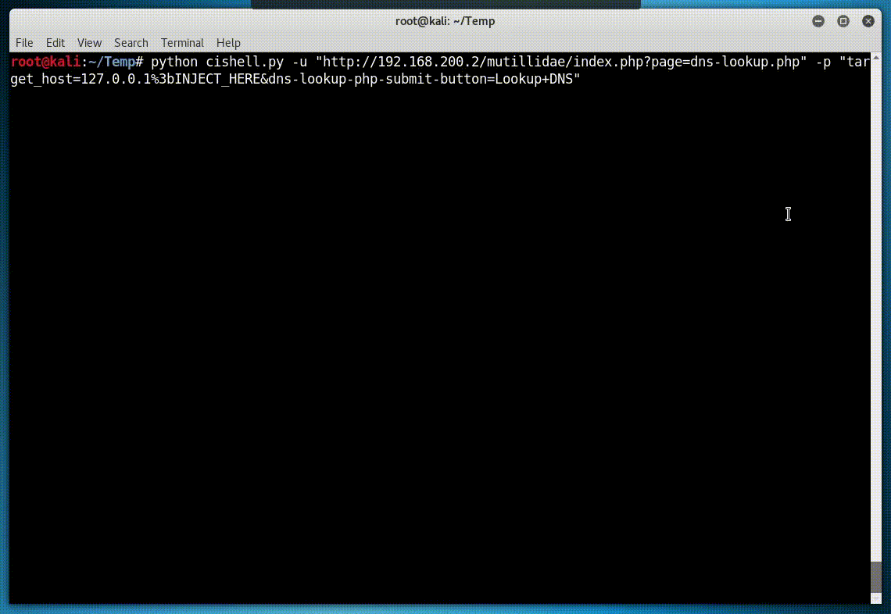

# CIShell 

**CIShell** (**C**ommand **I**njection **Shell**) is a lightweight OS command injection exploitation tool.

It emulates an 'interactive'-like shell with below features:
 - Tab completion for remote directory/file name.
 - Navigate remote directory path with `cd` command.
 - Download/Upload file with `get`/`put` command.
 - Navigate command history with arrow key (up/down).

It's intended to provide a more user-friendly environment to interact with remote server via HTTP OS command injection in case interactive shell is not straightforward to obtain.

Python version 2.7.x is required to run this program on Linux and Mac OS X.

Please take a look at below projects for features not available in this tool:
 - [commix](https://github.com/commixproject/commix)
 - [weevely](https://github.com/epinna/weevely3)
 - [pyshell](https://github.com/praetorian-inc/pyshell)

## Usage
To get a list of all options:
    
`python cishell.py -h`

Running against DVWA:

`python cishell.py -u "http://x.x.x.x/dvwa/vulnerabilities/exec/index.php" -p "ip=%3bINJECT_HERE&submit=submit" -H "Cookie: security=low; PHPSESSID=66e655868605ee08d581fb5a2fbecd89"`

Running against Mutillidae:

`python cishell.py -u "http://x.x.x.x/mutillidae/index.php?page=dns-lookup.php" -p "target_host=127.0.0.1 | INJECT_HERE&dns-lookup-php-submit-button=Lookup+DNS"`

## Known Issues
 - Mac OS X ships with libedit instead of GNU readline and may cause issue with command history navigation.
